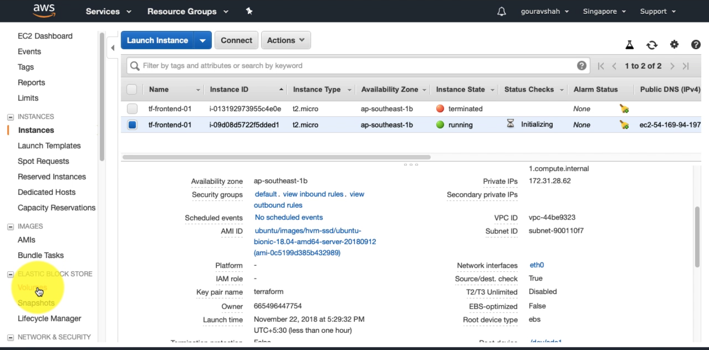
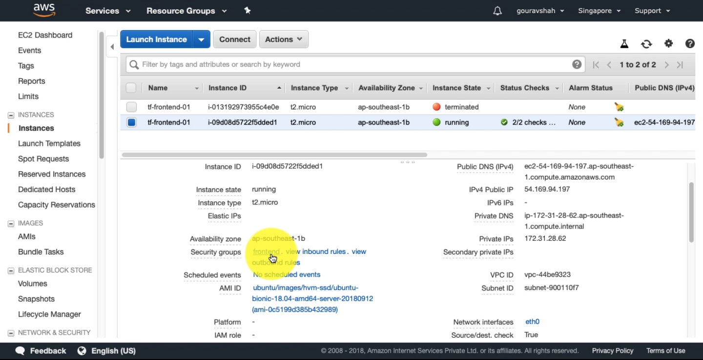

## Variables

Let us try to ssh into the machine that we've just created. Get the public IP from the AWS console.

```
ssh ubuntu@34.203.194.201

[output]
ssh: connect to host 34.203.194.201 port 22: Operation timed out
```

You will not be able to SSH. The reason is we have not associated the security group that we have created with this instance. The instance is still using the default security group which doesn't allow ssh. 



We need to fix this issue. Let us associate our security group with this machine.

`file: main.tf`

**Bad Practice**
```
resource "aws_instance" "webserver" {
  ami                    = "ami-408c7f28"
  instance_type          = "t1.micro"
  key_name               = "web-admin-key"
  vpc_security_group_ids = "sg-0c22a3497351d1caa"
  depends_on             = ["aws_key_pair.webserver_key"]

  tags {
    Name = "weberserver"
  }
}
```

We can manually copy the ID of the security group and apply the manifest. This would work but this is an ugly fix. We should let Terraform to find the these kind of mutable data. Thats where `Variables` come into picture.

### Type 1: Attribute of a Resource

`file: main.tf`  
**Good Practice**
```
resource "aws_instance" "webserver" {
  ami                    = "ami-408c7f28"
  instance_type          = "t1.micro"
  key_name               = "web-admin-key"
  vpc_security_group_ids = ["${aws_security_group.webserver_sg.id}"]
  depends_on             = ["aws_key_pair.webserver_key"]

  tags {
    Name = "weberserver"
  }
}
```

This is how variable interpolation works in Terraform. 

`Syntax: ${TYPE.NAME.ATTRIBUTE}`

In our case, it is, `${aws_security_group.webserver_sg.id}`.
Here,
  aws_security_group => TYPE
  webserver_sg       => NAME
  id                 => ATTRIBUTE

Every resource has set of attribute that can be referred as a variable. `aws_security_group` resource has the following attributes which can be referred.  
  * id - The ID of the security group  
  * arn - The ARN of the security group  
  * vpc_id - The VPC ID.  
  * owner_id - The owner ID.  
  * name - The name of the security group  
  * description - The description of the security group  
  * ingress - The ingress rules. See above for more.  
  * egress - The egress rules. See above for more.  

This also creates an `Implicit Dependency`. Terraform will know that this security group has to be created before the EC2 instance since the later refers to it. Let us apply the given manifest.  

Let us apply the manifest.

```
terraform apply 

[output]
An execution plan has been generated and is shown below.
Resource actions are indicated with the following symbols:
  ~ update in-place

Terraform will perform the following actions:

  ~ aws_instance.webserver
      vpc_security_group_ids.118229083:  "" => "sg-0c22a3497351d1caa"
      vpc_security_group_ids.3314100969: "sg-a42b7ae9" => ""


Plan: 0 to add, 1 to change, 0 to destroy.

Do you want to perform these actions?
  Terraform will perform the actions described above.
  Only 'yes' will be accepted to approve.

  Enter a value: yes

aws_instance.webserver: Modifying... (ID: i-0a7d259b3126e16b8)
  vpc_security_group_ids.118229083:  "" => "sg-0c22a3497351d1caa"
  vpc_security_group_ids.3314100969: "sg-a42b7ae9" => ""
aws_instance.webserver: Still modifying... (ID: i-0a7d259b3126e16b8, 10s elapsed)
aws_instance.webserver: Modifications complete after 13s (ID: i-0a7d259b3126e16b8)

Apply complete! Resources: 0 added, 1 changed, 0 destroyed.
```

Check in your AWS console to check the same.



Now you should be able to SSH into the machine.
```
ssh ubuntu@34.203.194.201

[output]
Warning: Permanently added '34.203.194.201' (ECDSA) to the list of known hosts.
Welcome to Ubuntu 14.04 LTS (GNU/Linux 3.13.0-29-generic x86_64)

ubuntu@ip-172-31-40-32:~$
```

`Exercise: Remove the explicit dependecy by using the key_pair with above given attribute reference method` 

### Type 2: User Defined(Input) Variables

It is always a good practice to remove data from code. In our manifest, we are hardcoding all the values. Instead we should use variables to define the values and reference them in the manifest. 

Create a new file with the name `variables.tf`

```
touch variables.tf
```

`Syntax`:
```
variable "name" {
  description = "describe your variable"
  default     = "default value"
}
```

Let us define our first variable in this file.

`file: variables.tf`
```
variable "ami" {
  description = "ami for the instance"
  default     = "ami-408c7f28"
}
```

This variable can be referenced in the main manifest like the following.

```
[...]
resource "aws_instance" "webserver" {
  ami                    = "${var.ami}"
  instance_type          = "t1.micro"
  key_name               = "web-admin-key"
  vpc_security_group_ids = ["${aws_security_group.webserver_sg.id}"]
  depends_on             = ["aws_key_pair.webserver_key"]

  tags {
    Name = "weberserver"
  }
}
[...]
```

Let us apply the manifest to see if this works. Terraform automatically loads all the files with `.tf` extension from the working directory. So we do not need to implicitly mention about the variable file.

```
terraform apply

[output]
aws_key_pair.webserver_key: Refreshing state... (ID: web-admin-key)
aws_security_group.webserver_sg: Refreshing state... (ID: sg-0c22a3497351d1caa)
aws_instance.webserver: Refreshing state... (ID: i-0a7d259b3126e16b8)

Apply complete! Resources: 0 added, 0 changed, 0 destroyed.
```

Let us parameterize some properties from our main manifest.

`file: variables.tf`
```
# default type is string
variable "ami" {
  description = "ami for the instance"
  default     = "ami-408c7f28"
}

# map type variable definition
variable "instance" {
  description = "instance parameters"
  type        = map
  default     = {
  	"type" = "t1.micro"
  	"name" = "demo-server"
  }
}

variable "key_name" {
  description = "name of the key"
  default     = "web-admin-key"
}

variable "key_pub" {
  description = "content of public key"
  default     = "ssh-rsa AAAAB3NzaC1yc2EAAAADAQABAAABAQC4Q2TBuAD7ijkPjp+/Hl/QnrNo4hoZEz/l+UBsfvlDuJk8zfh0ivnQLtoYyXNuJ3/BjTVVIchrGo8CLZdTco//n+YBvMqgW4Wg5F92JNNkR5L5x04ELRUmC3ed1ZqbwrLmujzB33nMJ8Ld5dJjtS55KJa5MwkCaP7lqGicU2NgXe+if2DhCKW/lZyCpkkvRgmB7oEqj6aBWNjp+FMY4v6BtcmmB/+1Ry+GMvmZJO1EjSeUHAWCec3snX7TxJKHf4opwTHxknmhRKkz8+pS8rxyjiBeyncxP9jL9Tx/Zh6qmExCUfuhAWk87sjbb3j0enVs2LtzJOG9eBZ726wD83TJ vibe@vibes-MacBook-Air.local"
}
```

Here is fully parameterized main manifest.
`file: main.tf`
```
provider "aws" {
  region = "us-east-1"
}

resource "aws_instance" "webserver" {
  ami                    = "${var.ami}"
  instance_type          = "${var.instance["type"]}"
  key_name               = "web-admin-key"
  vpc_security_group_ids = ["${aws_security_group.webserver_sg.id}"]
  depends_on             = ["aws_key_pair.webserver_key"]

  tags {
    Name = "${var.instance["name"]}"
  }
}

resource "aws_security_group" "webserver_sg" {
  name = "webserver-sg"

  ingress {
    from_port   = 22
    to_port     = 22
    protocol    = "tcp"
    cidr_blocks = ["0.0.0.0/0"]
  }
}

resource "aws_key_pair" "webserver_key" {
  key_name   = "${var.key_name}"
  public_key = "${var.key_pub}"
}
```

I've intentionally set the variable `instance.name` to `demo-server`. Let us apply the manifest.

```
terraform apply

[output]
aws_security_group.webserver_sg: Refreshing state... (ID: sg-0c22a3497351d1caa)
aws_key_pair.webserver_key: Refreshing state... (ID: web-admin-key)
aws_instance.webserver: Refreshing state... (ID: i-0a7d259b3126e16b8)

An execution plan has been generated and is shown below.
Resource actions are indicated with the following symbols:
  ~ update in-place

Terraform will perform the following actions:

  ~ aws_instance.webserver
      tags.Name: "weberserver" => "demo-server"


Plan: 0 to add, 1 to change, 0 to destroy.

Do you want to perform these actions?
  Terraform will perform the actions described above.
  Only 'yes' will be accepted to approve.

  Enter a value: yes

aws_instance.webserver: Modifying... (ID: i-0a7d259b3126e16b8)
  tags.Name: "weberserver" => "demo-server"
aws_instance.webserver: Still modifying... (ID: i-0a7d259b3126e16b8, 10s elapsed)
aws_instance.webserver: Modifications complete after 14s (ID: i-0a7d259b3126e16b8)

Apply complete! Resources: 0 added, 1 changed, 0 destroyed.
```
Terraform has substituted the value of `instance name` from variables, thus it has changed the resource as well.

### Type 3: Output Variables
Output variables help us to refer the metadata of resources after they are applied. This saves a lot of time, because we don't have to find go to AWS web console to find the details.


Let us get the public ip of the instance we've created by using output variable.

`file: main.tf`
```
[...]
output "webserver_ip" {
	value = "${aws_instance.webserver.public_ip}"
}
[...]
```

Output variables also uses variable interpolation. 

Run *terraform apply* to see output variables in action.

```
terraform apply

[output]
aws_security_group.webserver_sg: Refreshing state... (ID: sg-0c22a3497351d1caa)
aws_key_pair.webserver_key: Refreshing state... (ID: web-admin-key)
aws_instance.webserver: Refreshing state... (ID: i-0a7d259b3126e16b8)

Apply complete! Resources: 0 added, 0 changed, 0 destroyed.

Outputs:

webserver_ip = 34.203.194.201
```