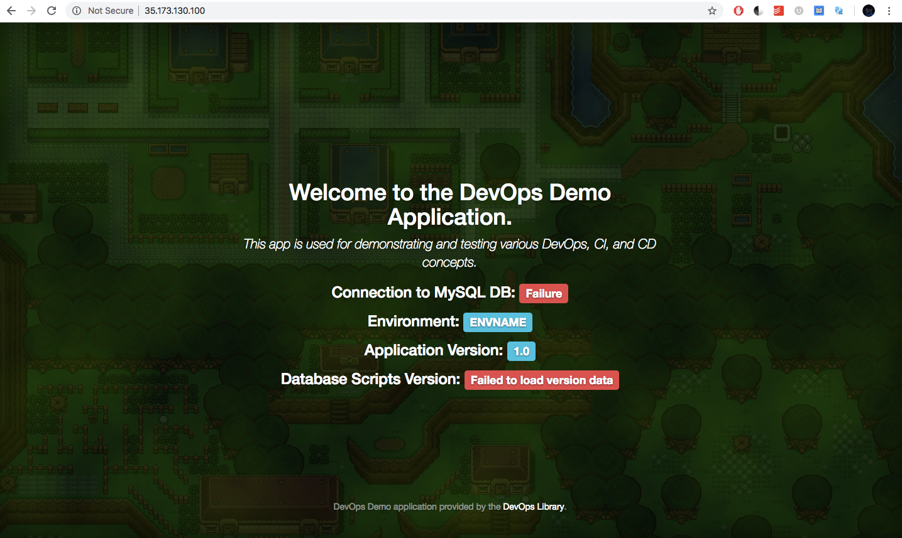

## Provisioners

Provisioners are used to execute scripts either on local machines or on remote machines. 
Provisioners will run at either
  1. Resource creation time , hence called `Creation-Time provisioner` or  
  2. Resource destruction time, hence called `Destroy-Time provisioner`  

Most generally used provisioners are,  
  * file        => copy file from local to remote
  * local-exec  => execute on the machine where you run Terraform commands
  * remote-exec => execute on the machine created/modified by Terrform
### Devops Demo Application

We will set up [this application](https://github.com/devopsdemoapps/devops-demo) using creation-time provisioner. 

### File Provisioner

Create a new file with the name `user-data.sh`

```
touch user-data.sh
```

`file: user-data.sh`
```
#!/bin/bash
sudo apt update
sudo apt install -y software-properties-common language-pack-en-base dialog apt-utils
sudo update-locale LC_ALL=en_US.UTF-8 LANG=en_US.UTF-8
sudo cp /usr/share/zoneinfo/America/New_York /etc/localtime
sudo LC_ALL=en_US.UTF-8 add-apt-repository -y ppa:ondrej/php
sudo apt update
sudo apt install -yq apache2 php5.6 php5.6-mysql mysql-client
sudo rm -rf /var/www/html/*
sudo wget https://github.com/devopsdemoapps/devops-demo/raw/master/devops-demo.tar.gz
sudo tar -xvzf devops-demo.tar.gz -C /var/www/html/
sudo wget https://raw.githubusercontent.com/devopsdemoapps/devops-demo/master/devops-demo.sql
sudo service apache2 restart
```

`file: main.tf`
```
[...]
resource "aws_instance" "webserver" {
  ami                    = "${var.ami}"
  instance_type          = "${var.instance["type"]}"
  key_name               = "web-admin-key"
  vpc_security_group_ids = ["${aws_security_group.webserver_sg.id}"]
  depends_on             = ["aws_key_pair.webserver_key"]

  tags {
    Name = "${var.instance["name"]}"
  }

  provisioner "file" {
    source      = "user-data.sh"
    destination = "/tmp/user-data.sh"

    connection {
      type        = "ssh"
      user        = "${var.ssh_user}"
      private_key = "${file(var.ssh_pvtkey)}"
    }
  }
}
[...]
```

This `file` type provisioner copies the user-data from our local machine to the remote instance on `/tmp/user-data.sh` path. It requires authentication details to scp the file to the machine. Let us set the credentials in our `variables.tf` file.

`file: variables.tf`
```
[...]
variable "ssh_user" {
  default = "ubuntu"
}

variable "ssh_pvtkey" {
  default = "~/.ssh/id_rsa"
}
[...]
```
We will need to destroy and recreate the resources to apply this provisioner

```
terraform destroy

[output]
Destroy complete! Resources: 3 destroyed.
```

```
terraform apply

[output]
aws_instance.webserver: Still creating... (10s elapsed)
aws_instance.webserver: Still creating... (20s elapsed)
aws_instance.webserver: Still creating... (30s elapsed)
aws_instance.webserver: Provisioning with 'file'...
aws_instance.webserver: Still creating... (40s elapsed)
aws_instance.webserver: Still creating... (50s elapsed)
aws_instance.webserver: Still creating... (1m0s elapsed)
aws_instance.webserver: Still creating... (1m10s elapsed)
aws_instance.webserver: Creation complete after 1m11s (ID: i-02888bbc102c4d0ed)

Apply complete! Resources: 3 added, 0 changed, 0 destroyed.

Outputs:

webserver_ip = 35.173.254.26
```

## Remote-Exec Provisioner

Now we will execute the script that we have just copied over.

`file: main.tf`
```
resource "aws_instance" "webserver" {
  ami                    = "${var.ami}"
  instance_type          = "${var.instance["type"]}"
  key_name               = "web-admin-key"
  vpc_security_group_ids = ["${aws_security_group.webserver_sg.id}"]
  depends_on             = ["aws_key_pair.webserver_key"]

  tags {
    Name = "${var.instance["name"]}"
  }

  provisioner "file" {
    source      = "user-data.sh"
    destination = "/tmp/user-data.sh"

    connection {
      type        = "ssh"
      user        = "${var.ssh_user}"
      private_key = "${file(var.ssh_pvtkey)}"
    }
  }
  provisioner "remote-exec" {
    inline = [
      "chmod +x /tmp/user-data.sh",
      "/tmp/user-data.sh",
    ]

    connection {
      type        = "ssh"
      user        = "${var.ssh_user}"
      private_key = "${file(var.ssh_pvtkey)}"
    }
  }
}
```

We will also add the ingress policy port `80` and egress policy for allo traffic in our security group.

`file: main.tf`
```
[...]
resource "aws_security_group" "webserver_sg" {
  name = "webserver-sg"

  ingress {
    from_port   = 22
    to_port     = 22
    protocol    = "tcp"
    cidr_blocks = ["0.0.0.0/0"]
  }

  ingress {
    from_port   = 80
    to_port     = 80
    protocol    = "tcp"
    cidr_blocks = ["0.0.0.0/0"]
  }

  egress {
    from_port   = 0
    to_port     = 0
    protocol    = "-1"
    cidr_blocks = ["0.0.0.0/0"]
  }
}
[...]
```

For this `remote-exec` provisioner to take effect, we need to recreate the resources(since these are creation-time provisoners).

```
terraform destroy

[output]
aws_instance.webserver: Still destroying... (ID: i-02888bbc102c4d0ed, 30s elapsed)
aws_instance.webserver: Still destroying... (ID: i-02888bbc102c4d0ed, 40s elapsed)
aws_instance.webserver: Destruction complete after 48s
aws_key_pair.webserver_key: Destroying... (ID: web-admin-key)
aws_security_group.webserver_sg: Destroying... (ID: sg-097c880ffd1c9f6c3)
aws_key_pair.webserver_key: Destruction complete after 1s
aws_security_group.webserver_sg: Destruction complete after 3s

Destroy complete! Resources: 3 destroyed.
```

```
terrform apply

[output]
aws_instance.webserver (remote-exec): Connecting to raw.githubusercontent.com (raw.githubusercontent.com)|151.101.200.133|:443... connected.
aws_instance.webserver (remote-exec): HTTP request sent, awaiting response... 200 OK
aws_instance.webserver (remote-exec): Length: 233 [text/plain]
aws_instance.webserver (remote-exec): Saving to: ‘devops-demo.sql’

aws_instance.webserver (remote-exec):  0%  0           --.-K/s
aws_instance.webserver (remote-exec): 100% 233         --.-K/s   in 0s

aws_instance.webserver (remote-exec): 2018-09-24 12:36:02 (9.54 MB/s) - ‘devops-demo.sql’ saved [233/233]
aws_instance.webserver: Creation complete after 5m11s (ID: i-02848bbc106c45ced)

Apply complete! Resources: 3 added, 0 changed, 0 destroyed.

Outputs:

webserver_ip = 35.173.130.100
```
Once the creation is complete, you should be able to access the application by visiting the instance's public IP.



## Reference  
For more details about provisioners, please visit [this link](https://www.terraform.io/intro/getting-started/provision.html).