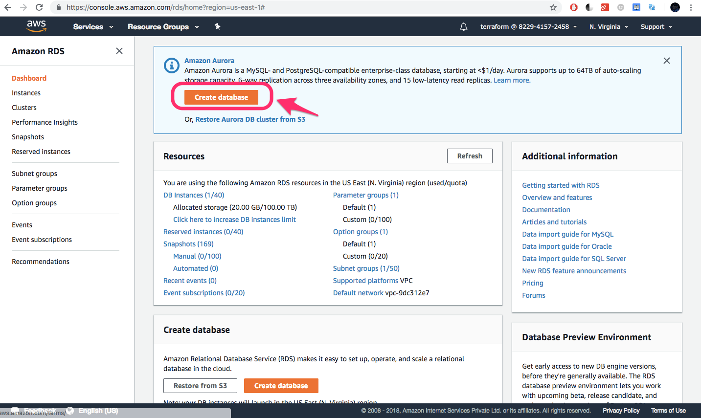
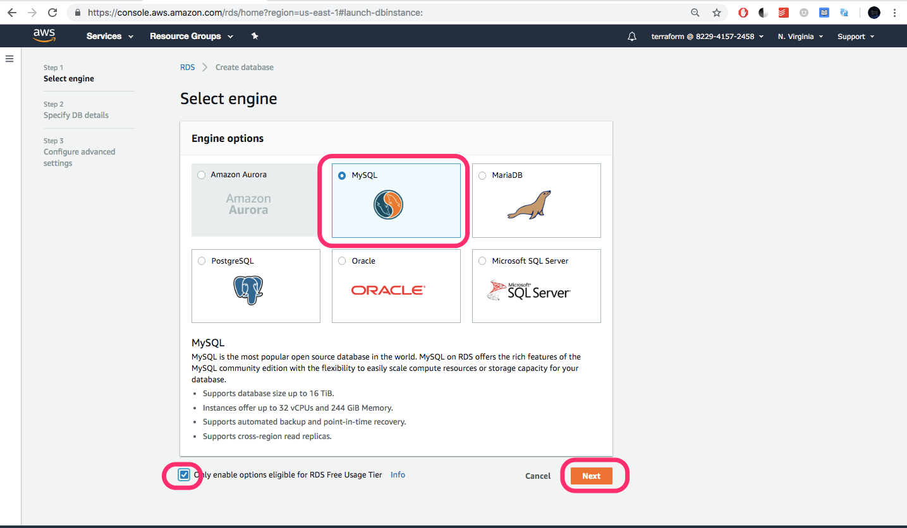
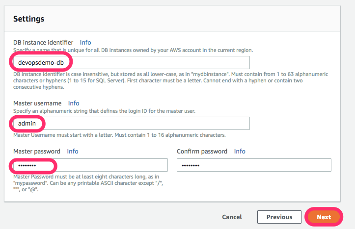
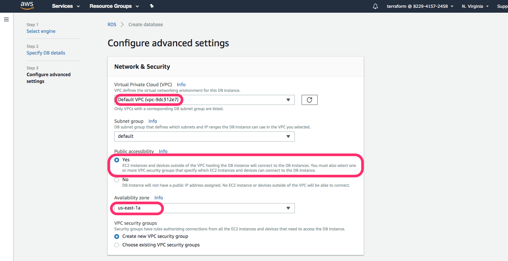
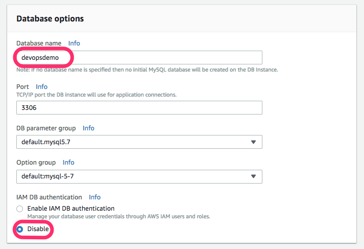
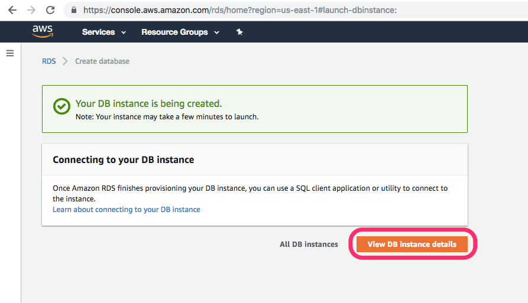

## Data Source

Data sources are read only information that Terraform can get from Provider's API. When we use data source, Terraform doesn't create/modify anything. It just queries the API, so that the data can be used by other resources.

Let us create a RDS DB manually and we will refer to it in our manifest.

### Creating RDS DB

  * Go to RDS service page.
  

  * Select MySQL DB Engine.
  

  * Provide the DB instance the following name and enter some complex password.
  

  * Provide the following network settings for the instance.
  

  * Provide your DB a name and disable IAM authentication.
  

  * Leave all other values to default and create the DB.
  

### Using Datasource

Let us add the [datasource block](https://www.terraform.io/docs/providers/aws/d/db_instance.html)  for RDS in our `main.tf`

`file: main.tf`

```
[...]
data "aws_db_instance" "database" {
  db_instance_identifier = "${var.rds_name}"
}
```

We have parameterized the attribute *db_instance_identifier* which is the db instance's name.

Define the variable *rds_name* in `variables.tf`.

`file: variables.tf`

```
[...]
variable "rds_name" {
  default = "devopsdemo-db"
}
[...]
```

Let us check whether Terraform is able to fetch the datasource details from AWS API.

`file: main.tf` 


```
[...]
output "rds_endpoint" {
  value = "${data.aws_db_instance.database.endpoint}"
}
[...]
```

Let us plan and apply.

```
terraform plan
terraform apply

[output]
Acquiring state lock. This may take a few moments...
aws_security_group.webserver_sg: Refreshing state... (ID: sg-0c740c046e9bcf571)
aws_key_pair.webserver_key: Refreshing state... (ID: web-admin-key)
data.aws_db_instance.database: Refreshing state...
aws_instance.webserver: Refreshing state... (ID: i-082d8b9097ae94c53)

Apply complete! Resources: 0 added, 0 changed, 0 destroyed.
Releasing state lock. This may take a few moments...

Outputs:

rds_endpoint = devopsdemo-db.cewjdhpv9lg6.us-east-1.rds.amazonaws.com:3306
webserver_ip = 54.165.195.171
```

We are able to get the endpoint for a resource which was not created Terraform.

We need to change the placeholder values with our rds db values, from `/var/www/html/config.ini` in our instance.

`file: main.tf`

```
[...]
resource "null_resource" "populate_db_01" {
  provisioner "local-exec" {
    command = "ssh ubuntu@${aws_instance.webserver.public_ip} 'sudo sed -i -e 's/DBHOST/${data.aws_db_instance.database.address}/g' /var/www/html/config.ini'"
  }

  provisioner "local-exec" {
    command = "ssh ubuntu@${aws_instance.webserver.public_ip} 'sudo sed -i -e 's/SQLUSER/${data.aws_db_instance.database.master_username}/g' /var/www/html/config.ini'"
  }

  provisioner "local-exec" {
    command = "ssh ubuntu@${aws_instance.webserver.public_ip} 'sudo sed -i -e 's/SQLPASSWORD/${var.rds_pass}/g' /var/www/html/config.ini'"
  }

  provisioner "local-exec" {
    command = "ssh ubuntu@${aws_instance.webserver.public_ip} 'sudo sed -i -e 's/SQLDBNAME/${data.aws_db_instance.database.db_name}/g' /var/www/html/config.ini'"
  }

  provisioner "local-exec" {
    command = "ssh ubuntu@${aws_instance.webserver.public_ip} 'sudo service apache2 restart'"
  }
}

[...]
```

We also need to define the *rds_pass* variable in `variables.tf`.

`file: variables.tf`

```
[...]
variable "rds_pass" {
  default = "Sup3rS3cr3t"
}
[...]
```

In this given example, we introduce a new resource called `null`, which helps us to use `local-exec` provisioner. 

We need to run `terraform init` to install the *null provider* plugin.

```
terraform init

[output]
Initializing the backend...

Initializing provider plugins...
- Checking for available provider plugins on https://releases.hashicorp.com...
- Downloading plugin for provider "null" (1.0.0)...

The following providers do not have any version constraints in configuration,
so the latest version was installed.

To prevent automatic upgrades to new major versions that may contain breaking
changes, it is recommended to add version = "..." constraints to the
corresponding provider blocks in configuration, with the constraint strings
suggested below.

* provider.aws: version = "~> 1.37"
* provider.null: version = "~> 1.0"

Terraform has been successfully initialized!

You may now begin working with Terraform. Try running "terraform plan" to see
any changes that are required for your infrastructure. All Terraform commands
should now work.

If you ever set or change modules or backend configuration for Terraform,
rerun this command to reinitialize your working directory. If you forget, other
commands will detect it and remind you to do so if necessary.
```

Then run *terraform plan and apply*

```
terraform plan
terrafomr apply

[output]

Acquiring state lock. This may take a few moments...
aws_key_pair.webserver_key: Refreshing state... (ID: web-admin-key)
aws_security_group.webserver_sg: Refreshing state... (ID: sg-0c740c046e9bcf571)
data.aws_db_instance.database: Refreshing state...
aws_instance.webserver: Refreshing state... (ID: i-082d8b9097ae94c53)

An execution plan has been generated and is shown below.
Resource actions are indicated with the following symbols:
  + create

Terraform will perform the following actions:

  + null_resource.populate_db_01
      id: <computed>


Plan: 1 to add, 0 to change, 0 to destroy.

Do you want to perform these actions?
  Terraform will perform the actions described above.
  Only 'yes' will be accepted to approve.

  Enter a value: yes

[...]
null_resource.populate_db_01: Provisioning with 'local-exec'...
null_resource.populate_db_01 (local-exec): Executing: ["/bin/sh" "-c" "ssh ubuntu@54.165.195.171 'sudo service apache2 restart'"]
null_resource.populate_db_01 (local-exec):  * Restarting web server apache2
null_resource.populate_db_01 (local-exec):    ...done.
null_resource.populate_db_01: Creation complete after 20s (ID: 8985065039495500214)

Apply complete! Resources: 1 added, 0 changed, 1 destroyed.
```